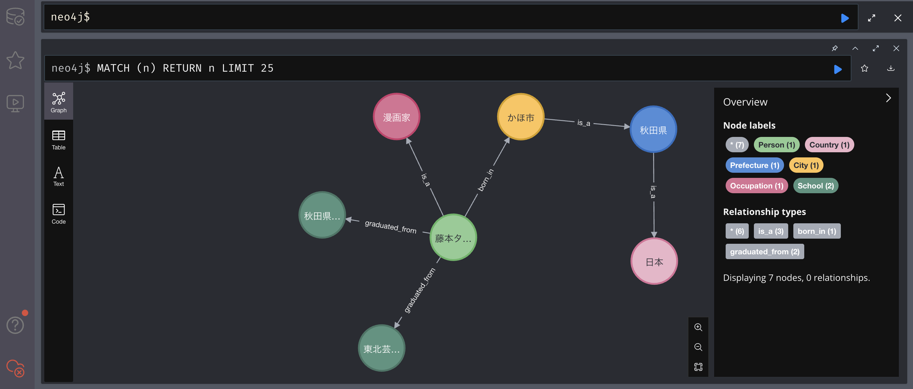

# Wikipediaからナレッジグラフを作成&QA

## 環境構築

Dockerコンテナを起動する。  
```bash
cd 02_read_wiki
docker-compose build
docker-compose up -d
```

Neo4jのWeb画面にアクセスする。  
http://localhost:7474/browser/  

Web画面上で以下を入力  
Connect to Neo4j  
* Connect URL: neo4j://localhost:7687
* Database: 空白
* Authentication Type: Username / Password
* Username: neo4j
* Password: pleaseletmein

ログインID:neo4j、パスワード:pleaseletmeinでログインする。  
ログインIDやパスワードは[neo4j_docker/Dockerfile](neo4j_docker/Dockerfile)の以下で指定している。
```Dockerfile
ENV NEO4J_AUTH=neo4j/pleaseletmein  
```

## コード実行

デモコードは以下の処理を実施しています。
1. Wikipediaから藤本タツキ先生の要約を取得
2. 要約からCypherクエリを生成
3. CypherクエリをNeo4jに投入
4. 質問(藤本タツキは何者ですか？)に対する回答を取得

実行コマンドは以下になります。

```bash
# Dockerコンテナに入る
docker exec -it python_docker bash
# OpenAI APIキーを設定
export OPENAI_API_KEY="..."

# デモコードを実行
python3 src/demo.py
```

## 実行結果

```bash
### 藤本タツキのwiki要約 ###
藤本 タツキ（ふじもと タツキ、1992年〈平成4年〉10月10日 – ）は、日本の男性漫画家。秋田県にかほ市出身。秋田県立仁賀保高等学校情報メディア科CGデザインコース卒、東北芸術工科大学美術科洋画コース卒。
##################################################


> Entering new LLMChain chain...
Prompt after formatting:

以下の文章からグラフを作成するCypherクエリのみを出力して下さい。
ただし[:is a]の関係は[:is_a]のように_を含む形で出力して下さい。
藤本 タツキ（ふじもと タツキ、1992年〈平成4年〉10月10日 – ）は、日本の男性漫画家。秋田県にかほ市出身。秋田県立仁賀保高等学校情報メディア科CGデザインコース卒、東北芸術工科大学美術科洋画コース卒。


> Finished chain.
### 藤本タツキの要約からCypherクエリを生成 ###
CREATE (fujimoto:Person {name: "藤本タツキ", birthdate: "1992年10月10日"})
CREATE (japan:Country {name: "日本"})
CREATE (akita:Prefecture {name: "秋田県"})
CREATE (kaho:City {name: "かほ市"})
CREATE (fujimoto)-[:is_a]->(mangaka:Occupation {name: "漫画家"})
CREATE (akita)-[:is_a]->(japan)
CREATE (kaho)-[:is_a]->(akita)
CREATE (fujimoto)-[:born_in]->(kaho)
CREATE (fujimoto)-[:graduated_from]->(highschool:School {name: "秋田県立仁賀保高等学校情報メディア科CGデザインコース"})
CREATE (fujimoto)-[:graduated_from]->(university:School {name: "東北芸術工科大学美術科洋画コース"})
##################################################

### 藤本タツキに関する質問に対する回答 ###


> Entering new GraphCypherQAChain chain...
Generated Cypher:
MATCH (p:Person {name: '藤本タツキ'})-[:is_a]->(o:Occupation)
RETURN o.name
Full Context:
[{'o.name': '漫画家'}]

> Finished chain.
Q: 藤本タツキは何者ですか？
A: 藤本タツキは漫画家です。
##################################################
```

作成されたナレッジグラフは以下のようになる。  


